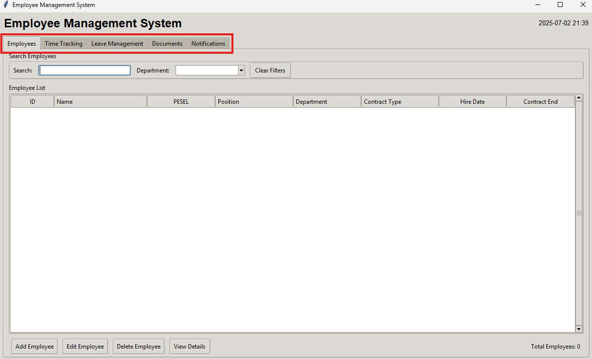

# User Guide

This guide explains how to use the Employee Management System to manage employees, working time, leave periods, and more. After you launch **EmployeeManagement.exe**, the main interface appears:

The tabs represent the core functions of the application. The following sections will guide you through each feature available in the interface.

## Employess

## Time Tracking

## Leave Management

## Documents

## Notifications 

